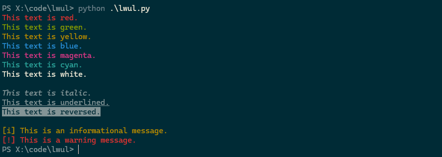

<p align="center">
    
</p>

<p align="center">
    LightWeight Useful Library (lwul) for Python — zero-dependency utility functions.
</p>

## Table of Contents

- [What is lwul?](#what-is-lwul)
- [How to Use](#how-to-use)
- [Demo](#demo)
- [Contributing](#contributing)
- [License](#license)

## What is lwul?

`lwul` is a tiny, dependency-free set of utility functions for everyday Python use.  
Simple to drop into any project without any setup.

## How to Use

Here are 2 simple options:

1. **Copy `lwul.py` into your project**  
   Place `lwul.py` next to your script and import it:
   ```python
   from lwul import your_function
   ```

2. **Copy-paste** the specific function(s) you need directly into your code.

No setup, no packages, no hassle — just useful code ready to go.

---

## Demo

Simply run the script directly to see all testable functions in action:
```bash
python lwul.py
```

<p align="center">
    
</p>

Example screnshot as of `v1.0.0`.

---

## Contributing

Want to improve lwul? Check out [CONTRIBUTING.md](CONTRIBUTING.md) for a quick guide.

---

## License

This project is licensed under the [MIT License](LICENSE).

---

lwul is meant to **help**, not to stand in your way.  
This is a **work in progress** — more helpers will be added over time.
